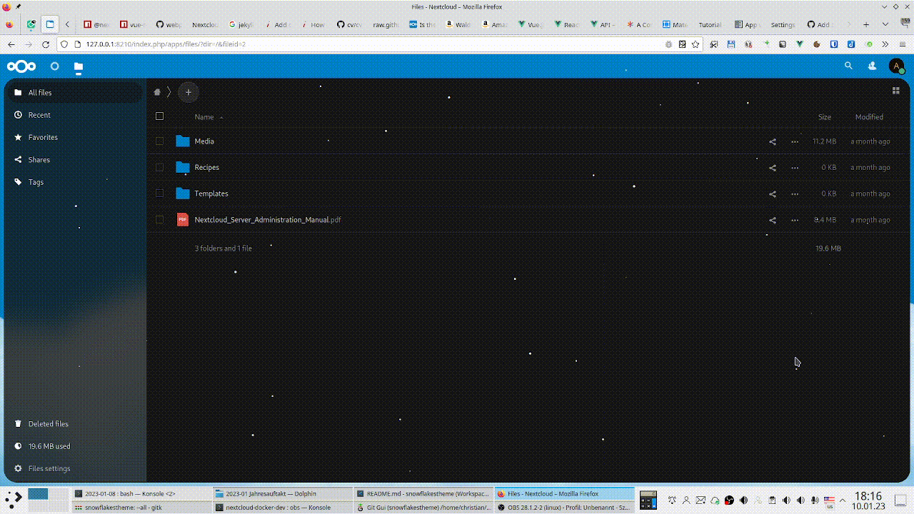

<!--
SPDX-FileCopyrightText: Christian Wolf <github@christianwolf.email>
SPDX-License-Identifier: CC0-1.0
-->

# Snowflakes Theme

This app adds some snowflakes to the web UI of your Nextcloud server.

In the admin settings the system administrator can set up some configurations. Also, the users can individually disable the app in their personal configuration.

For issues and questions, contact me via the [issues of this repository on Github](https://github.com/christianlupus-nextcloud/snowflakestheme/issues).
